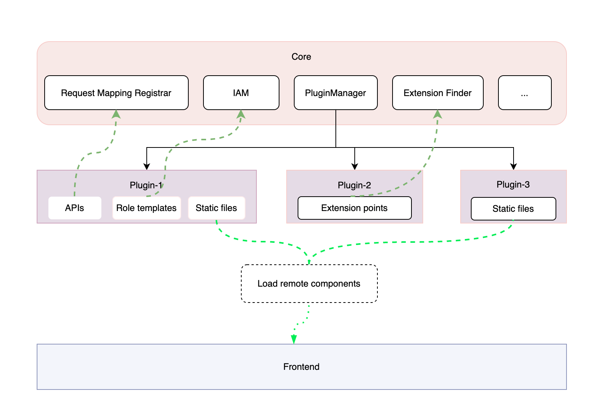

# 插件化功能设计

实现 Halo 插件化系统，以便对核心功能进行扩展，在不缺失主要功能的同时防止 core 过大。插件能力有助于社区生态的构建。

## 目标

后端插件化

- 后端支持 API 拓展机制，提供统一的 API 聚合，通过 core 的访问控制模块（IAM） 进行统一鉴权。
- 支持扩展点机制，插件通过实现 core 中暴露的扩展点接口来增强 core 的能力，如扩展附件存储提供者。
- 插件允许通过 core 提供的数据持久化机制来进行数据操作（CRUD）。
- 插件允许调用 core 提供的公开接口对 core 的数据进行操作。

管理端前端插件化

- 前端项目支持插件化，可通过插件在各级导航栏插入新的功能入口，实现功能页面的动态添加。

- 通过各个页面或组件的扩展点来实现原有功能的扩展。

公共目标

- 插件管理：提供可视化的插件管理机制，支持插件的安装、卸载、启用、停用、配置、升级。
- 插件仓库：提供插件的打包、发布机制，提供内置的插件仓库。
- 插件框架：提供插件开发、打包、发布相关的脚手架，提供完善的插件开发文档。

## 非目标

- 插件安全检查。
- 插件代码风格检查。

管理端前端：

- 不适配多种前端渲染框架，仅支持与 Core 一致的技术栈（Vue）。

## 背景和动机

目前 1.0 版本中社区提出了很多非普适功能的 issue，为了控制 core 的大小会挑选重要的功能进行实现， 这对使用者来说很不方便。
包括但不限于以下 issue：

- [期望增加微信公众号管理功能](https://github.com/halo-dev/halo/issues/1990)
- [希望可以添加对 UML 渲染支持](https://github.com/halo-dev/halo/issues/1419)
- [私有文章功能增强。附件功能增强。文章 url 混淆](https://github.com/halo-dev/halo/issues/994)
- [集成 umami 到 halo](https://github.com/halo-dev/halo/issues/1285)

如果增加了插件化能力，社区可以根据自己的需要进行插件开发以扩展核心功能，使用者也可以在插件仓库查找自己需要的插件来满足功能。

该功能的实现会很大程度的提高社区活跃度并壮大社区，同时很多在 1.0 版本中加入的许多功能都可以抽取为独立插件以减小 core 的大小，用户可以根据需要选择合适的插件来达到目的。

## 设计

### 术语

- **Extension Point**
  - 由 Halo 定义的用于添加特定功能的接口。
  - 扩展点应该在服务的核心功能和它所认为的集成之间的交叉点上。
  - 扩展点是对服务的扩充，但不是影响服务的核心功能：区别在于，如果没有其核心功能，服务就无法运行，而扩展点对于特定的配置可能至关重要该服务最终是可选的。
  - 扩展点应该小且可组合，并且在相互配合使用时，可为 Halo 提供比其各部分总和更大的价值。
- **Extension**
  - Extension Point（扩展点）的一种具体实现。

### Backend

#### 描述

插件启用时由 PluginManager 负责加载，包括 :

- APIs: 委托给 Request mapping registrar 管理。
- Extension Point：委托给 Extension Finder 管理。
- Static files：由 PluginClassLoader 加载。
- 类似 manifest 和 role template 的 yaml。
- Listeners：由 PluginApplicationContext 管理。
- Spring Bean Components：委托给 PluginApplicationContext 管理。
- core 中标注了 `@SharedEvent` 注解的事件被发布时由 `PluginApplicationEventBridgeDispatcher` 桥接给已启用的插件使用。



当插件被启用时由 `PluginManager` 创建一个新的 `PluginClassLoader` 实例负责加载插件类和资源，加载顺序符合双亲委派机制（见图 Figure 2–1 Class Loader Runtime Hierarchy）
`PluginClassLoader` 的 `parent` 为 Halo 使用的类加载器，因此它能够访问 Halo 中已被加载的所有类。


> 参考链接：
>
> [Chapter 5. Loading, Linking, and Initializing](https://docs.oracle.com/javase/specs/jvms/se17/html/jvms-5.html)
>
> [Chapter 12. Execution](https://docs.oracle.com/javase/specs/jls/se17/html/jls-12.html#jls-12.6)
>
> [Class Loader API Doc](https://docs.oracle.com/en/java/javase/17/docs/api/java.base/java/lang/ClassLoader.html)
>
> [Oracle Chapter 2 Class Loaders](https://docs.oracle.com/cd/E19501-01/819-3659/beade/index.html)

#### 资源配置

**plugin-manifest：**

```yaml
apiVersion: v1
kind: Plugin
metadata:
  # 'name' must match the filename of the manifest. The name defines how
  # the plugin is invoked
  name: plugin-1
  labels:
    extensions.guqing.xyz/category: attachment
spec:
  # 'version' is a valid semantic version string (see semver.org).
  version: 0.0.1
  requires: ">=2.0.0"
  author: guqing
  logo: https://guqing.xyz/avatar
  pluginClass: xyz.guqing.plugin.potatoes.PotatoesApp
  pluginDependencies:
   "plugin-2": 1.0.0
  # 'homepage' usually links to the GitHub repository of the plugin
  homepage: https://github.com/guqing/halo-plugin-1
  # 'displayName' explains what the plugin does in only a few words
  displayName: "a name to show"
  description: "Tell me more about this plugin."
  license: MIT
```

- `version`: 指定当前插件版本号，规则参考[插件版本控制](#插件版本控制)
- `requires: >=2.0.0` 表示 halo 系统版本必须大于 2.0.0，支持使用`>`, `<`, `=`, `>=`or`<=`进行比较，或`-`指定包含范围，可以用来`||`结合

> 例如：
>
> requires: 2.1
>
> requires: 1.0.0 - 1.2.0 (连字符两边必须有空格)
>
> requires: >2.0.x
>
> requires: <=2.0.x || >2.2.x

- `author`：插件作者名称。
- `logo`：插件的 logo。
- `pluginClass` ： 继承了`run.halo.app.extensions.SpringPlugin`的类全限定名，用于干预插件生命周期和类扫描。
- `pluginDependencies`: 如果依赖了其他插件则使用`pluginId:version`的格式[可选]。
- `homepage`: 插件的主页[可选]。
- `displayName`:插件的显示名称。
- `description`: 详细介绍[可选]。
- `license`：插件遵循的软件协议[可选]。

**plugin role templates：**

如果需要对插件提供的 API 进行权限控制，可以定义 role template，当插件启用时会被加载以使用 Halo 的权限控制体系进行统一的 API 权限控制。

```yaml
apiVersion: v1
kind: Role
metadata:
  name: role-manage-plugin-apis
  labels:
    guqing.xyz/role-template: true
  annotations:
    guqing.xyz/dependencies: ["role-template-view-plugin-apis"]
    guqing.xyz/module: "Test Plugin"
    guqing.xyz/alias-name: "Test Plugin"
rules:
  - apiGroups: ["plugin1.guqing.xyz"]
    resources: ["plugin-tests"]
    verbs: ["*"]
```

##### Extension Point 插件

Halo 使用 [Java 插件框架 (PF4J)](https://github.com/pf4j/pf4j) 来表示服务的 **扩展点** 接口。您可以创建一个插件来实现扩展点中声明的方法。基于扩展点创建插件有很多优点：

- 这是最简单的 - 使用 `@Extension` 注解并实现扩展点中声明的方法。
- Halo 将插件加载到隔离的类路径中。
- 它的维护工作量最少。
- Halo 的更新不太可能破坏你的插件。

这里有一个 [PoC](https://github.com/guqing/halo-plugin-experimental/tree/main/core/src/main/java/run/halo/app/extensions) 可供预览

#### 定义 Extension Point

扩展点接口必须继承 `ExtensionPoint` 以表示该接口为扩展点

```java
public interface FileHandler extends ExtensionPoint {

  UploadResult upload(@NonNull MultipartFile file);

  void delete(@NonNull String key);

  boolean supports(@NonNull FileHandler handler);
}
```

为了安全性考虑，不能让插件调用 core 中所有方法或 APIs，而是单独提供一个工具包，其中包含了插件可使用的 interface，这里称之为: `pluggable-suite`，插件依赖 `pluggable-suite` 后实现其中的某些扩展点或调用一些方法来制作插件。

core 中会对已经定义的可扩展的代码使用 ExtensionPointFinder 来查找扩展点，当实现了指定扩展点的插件被启用时就会被发现，结果是一个有序集合。

```java
@Slf4j
@Component
public class FileHandlers {

  private final ExtensionComponentsFinder extensionComponentsFinder;

  public FileHandlers(ExtensionComponentsFinder extensionComponentsFinder) {
    this.extensionComponentsFinder = extensionComponentsFinder;
  }

  @NonNull
  public UploadResult upload(@NonNull MultipartFile file,
                             @NonNull AttachmentType attachmentType) {
    return getSupportedType(attachmentType).upload(file);
  }

  public void delete(@NonNull Attachment attachment) {
    Assert.notNull(attachment, "Attachment must not be null");
    getSupportedType(attachment.getType())
      .delete(attachment.getFileKey());
  }

  public boolean supports(FileHandler fileHandler) {
    AttachmentType attachmentType = optionService.getEnumByPropertyOrDefault(
      AttachmentProperties.ATTACHMENT_TYPE, AttachmentType.class, AttachmentType.LOCAL);
    return instance.getAttachmentType() == attachmentType;
  }

  private FileHandler getSupportedType(AttachmentType type) {
    ExtensionList<FileHandler> extensionList = extensionComponentsFinder.lookup(FileHandler.class);

    for (ExtensionComponent<FileHandler> extensionComponent : extensionList.getComponents()) {
      FileHandler instance = extensionComponent.getInstance();
      if (supports(instance.getAttachmentType())) {
        log.info("Used {} file handler(s)", instance);
        return instance;
      }
    }
    throw new FileOperationException("No available file handlers to operate the file")
      .setErrorData(type);
  }
}
```

#### 生命周期方法

通过继承`Plugin`来表示该类为插件的主类，加载时会从此类开始并扫描此类同级目录及子目录下的类，将其加载到 Halo 中。

它具有`start`、`stop`、`delete`生命周期方法，分别会在插件启动、停止和卸载时被调用。

```java
public class PotatoesApp extends Plugin {

    public PotatoesApp(PluginWrapper wrapper) {
        super(wrapper);
    }

    @Override
    public void start() {
        super.start();
    }

    @Override
    public void stop() {
        super.stop();
    }

    @Override
    public void delete() {
        super.delete();
    }
}
```

#### 定义 APIs

使用`@RestController`和`@Controller`来声明是插件的控制器

```java
@RestController
@RequestMapping("/plugins/potatoes")
public class PotatoesController {

    @Autowired
    private PotatoService potatoService;

    @GetMapping("/name")
    public String name() {
        potatoService.create();
        return "Lycopersicon esculentum";
    }

    @GetMapping("/boom")
    public String boom() {
        return String.valueOf(1 / 0);
    }
}
```

#### 发布订阅

1. 插件内部允许存在独立的事件和监听器

```java
@Slf4j
@Component
public class PotatoesVisitListener {

    @EventListener(PotatoesVisitEvent.class)
    public void onPluginStarted(PotatoesVisitEvent event) {
        log.info("Potato visited event: {}", event);
    }
}
```

2. 插件监听 Halo 中发布的事件

当 Halo 中标注了 `@SharedEvent` 注解的事件被发布时插件中可以使用同样的方式监听到

例如：

```java
@SharedEvent
public class PostVisitEvent extends ApplicationEvent {
  private final Integer id;
  public PostVisitEvent(Object source, @NonNull Integer postId) {
    super(source);

    Assert.notNull(id, "The postId must not be null.");
    this.id = id;
  }

  @NonNull
  public Integer getId() {
    return id;
  }
}
```

插件中监听它，你可以使用两种方式

1. 使用 `@EventListener`注解监听事件

```java
@Slf4j
@Component
public class HaloEventListener {

    @EventListener(PostVisitEvent.class)
    public void onPostVisited(PostVisitEvent event) {
        log.info("Post visited event listener: {}", event);
    }
}
```

2. 实现 `ApplicationListener` 指定范型来表明具体要监听的事件

```java
@Component
public class HaloPostVisitListener implements ApplicationListener<PostVisitEvent> {
    @Override
    public void onApplicationEvent(PostVisitEvent event) {
        System.out.println("The posts was visited...");
    }
}
```

#### 数据持久化

通过自定义模型来完成插件数据持久化功能。
TODO 细节待补充

#### 插件版本控制

为了保持 Halo 生态系统的健康、可靠和安全，每次您对自己拥有的插件进行重大更新时，我们建议在遵循 [semantic versioning spec](http://semver.org/) 的基础上，发布新版本。遵循语义版本控制规范有助于其他依赖你代码的开发人员了解给定版本的更改程度，并在必要时调整自己的代码。

我们建议你的包版本从`1.0.0`开始并递增，如下：

| Code status                               | Stage         | Rule                                         | Example version |
| ----------------------------------------- | ------------- | -------------------------------------------- | --------------- |
| First release                             | New product   | 从 1.0.0 开始                                | 1.0.0           |
| Backward compatible bug fixes             | Patch release | 增加第三位数字                               | 1.0.1           |
| Backward compatible new features          | Minor release | 增加中间数字并将最后一位重置为零             | 1.1.0           |
| Changes that break backward compatibility | Major release | 增加第一位数字并将中间和最后一位数字重置为零 | 2.0.0           |

#### 插件自定义 API 设计

插件自定义 API 应尽可能符合 Halo API 规范。且不同插件产生的 API 不会产生冲突。

##### 插件自定义 API 样例

我们假设：

- 插件资源清单：

  ```yaml
  apiVersion: plugin.halo.run/v1alpha1
  kind: Plugin
  metadata:
    name: my-plugin
  ```

- Apple 并不是插件的自定义模型
- AppleController 定义如下：

  ```java
  @ApiVersion("v1alpha1") // 该注解的 value 值将会作为 API 的 version 部分。“group.halo.run/v1alpha1” 和 “v1alpha1” 都将视为 “v1alpha1”。
  @RequestMapping("/apples")
  @RestController
  public class AppleController {

      @PostMapping("/starting")
      public void starting() {
      }

  }
  ```

当插件被注册时，我们将会为 AppleController 生成统一路径的 API。API 前缀组成规则如下：

```text
/api/{version}/plugins/{plugin-name}/**
```

例如：`/api/v1alpha1/plugins/my-plugin/apples/starting`。

Role 配置样例如下：

```yaml
apiVersion: v1alpha1
kind: Role
metadata:
  name: apple-role
rules:
  # 插件自定义 API 规则配置
  - resources: ["apples"]
    verbs: ["create"]
    plugin: my-plugin # 新增 plugin 字段，主要为了区分当前规则是否匹配某个插件中自定义接口。
  # 常规规则配置
  - apiGroups: [""]
    resources: ["users"]
    verbs: ["list", "get"]
```

##### API 构成讨论

- [ ] `/apis/{group}/{version}/plugins/{plugin-name}/**`

  由于 group 和 version 可任意指定，可能会和系统自动生成的 Plugin 的 API 冲突。例如：`/apis/plugin.halo.run/v1alpha1/plugins/my-plugin/**`。

- [ ] `/apis/{plugin-name}/{version}/**`

  由于 plugin-name 可任意指定，可能会和系统中的 API 产生冲突。例如：`/apis/plugin.halo.run/v1alpha1/plugins/**`。

- [ ] `/api/plugins/{plugin-name}/{version}/**`

  背离 API 构成规则，解析起来难度相对较大。

- [x] `/api/{version}/plugins/{plugin-name}/**`

  符合 API 构成规则，避免 API 冲突并且方便识别并解析。

#### 插件依赖插件

MVP(minimum viable product) 版本中不实现

TBD

#### 插件版本更新

MVP(minimum viable product) 版本中不实现（可先通过先卸载后安装的方式解决）

TBD

#### 插件工程化

插件可以使用 Maven 或 Gradle 等项目构建工具依赖 `pluggable-suite`，该工具中提供了扩展点接口、公共接口和一些工具帮助快速构建插件。

一个常见的使用 Gradle 作为构建工具的插件目录结构如下：

```plaintext
├── LICENSE
├── README.md
├── admin-frontend
│   ├── README.md
│   ├── env.d.ts
│   ├── package.json
│   ├── pnpm-lock.yaml
│   ├── src
│   │   ├── assets
│   │   │   └── logo.svg
│   │   ├── components
│   │   │   └── HelloWorld.vue
│   │   ├── index.ts
│   │   ├── styles
│   │   │   └── index.css
│   │   └── views
│   │       └── DefaultView.vue
│   └── vite.config.ts
├── build
│   ├── classes
│   │   └── java
│   │       └── main
│   │           ├── META-INF
│   │           │   └── plugin-components.idx
│   ├── libs
│   │   └── halo-plugin-template-1.0-SNAPSHOT-plain.jar
├── build.gradle
├── gradlew
├── gradlew.bat
├── settings.gradle
└── src
    └── main
        ├── java
        │   └── io
        │       └── github
        │           └── guqing
        │               └── template
        │                   ├── ApplesController.java
        │                   └── post
        │                       ├── Post.java
        │                       ├── PostController.java
        │                       ├── PostRepository.java
        │                       └── PostService.java
        └── resources
            ├── admin
            │   ├── halo-plugin-template.js
            │   └── style.css
            ├── extensions
            │   ├── reverseproxy.yaml
            │   └── roles.yaml
            ├── plugin.yaml
```

插件可以引入 `pluggable-suite` 中没有提供的依赖，例如使用 `Gradle` 作为项目构建工具时，单独在插件中引入 `commons-lang3` 示例：

```java
implementation "org.apache.commons:commons-lang3:3.10"
```

需要注意的是：如果 Halo 已经存在了相同`group:name`的依赖，那么插件再引入该依赖即使版本不同，也会以 Halo 中的为准。
Reason: 根据 [描述](#描述)中关于类加载的说明，插件使用的 `PluginClassLoader` 的 `parent` 为 Halo 的类加载器且插件类加载规则符合双亲委派机制，
所以 Halo 中已加载的类对插件是可见的，那么插件类加载时 Halo 中存在的类就[不会被重复加载](https://docs.oracle.com/en/java/javase/17/docs/api/java.base/java/lang/ClassLoader.html)。

> - 每个类加载器都有自己的命名空间，命名空间由加载该类的加载器及所有父加载器所加载的类组成，
>   因此各插件和 Halo 所属同一个命名空间，但插件与插件之间属于不同的命名空间。
> - 在同一个命名空间中，不会出现类的完整名字（包括类的包名） 相同的两个类。
> - 在不同的命名空间中，有可能会出现类的完整名字（包括类的包名）相同的两个类。

**如何开发一个插件：**

TBD.

**如何调试：**

TBD.

### Admin Frontend

#### 名词定义

1. Admin Core：Halo 管理端核心项目
2. Monorepo：<https://pnpm.io/workspaces>

#### 前置条件

1. 插件应当使用与 Admin Core 的相同技术栈，即 Vue 3、Pinia、Vue Router 等。但不限制插件使用其他的三方依赖。

2. Admin Core 采用 Monorepo 进行管理，将分为 `core`、`@halo-dev/components`、`@halo-dev/shared` 等仓库。

   1. core：即 Admin Core 的相关代码。

   2. @halo-dev/components：公共 UI 组件，将被 Admin Core 和各个插件依赖，且插件在构建的时候应当排除掉这个包。

   3. @halo-dev/shared：公共的一些代码，其中可能包括接口请求的封装、类型定义、状态管理库等。需要被  Admin Core 和各个插件依赖，且插件在构建的时候应当排除掉这个包。

3. 推荐使用 TypeScript 以获得更好的类型推断和编辑器提示，但不限制使用 JavaScript。

#### 入口文件

此文件作为唯一的入口，里面包含如路由、Extension Point、菜单等定义，使用声明式的写法。此文件最终导出的应该是一个 Plugin 类型的对象。

Plugin 类型定义（需要包含在 `@halo-dev/shared` 包）：

```typescript
import type { Component } from "vue";
import type { RouteRecordRaw } from "vue-router";
import type { MenuGroupType } from "./menu";
import type { PostsPagePublicState } from "./post";
import type { DashboardPublicState } from "./dashboard";
import type { UserProfileLayoutPublicStates } from "./user";

export type ExtensionPointType =
  | "POSTS"
  | "POST_EDITOR"
  | "DASHBOARD"
  | "USER_SETTINGS";

export type ExtensionPointState =
  | PostsPagePublicState
  | DashboardPublicState
  | UserProfileLayoutPublicStates;

export interface HaloRouteRecord extends RouteRecordRaw {
  parent?: string;
}

export interface Plugin {
  name: string;

  components: Component[];

  activated?: () => void;

  deactivated?: () => void;

  routes?: HaloRouteRecord[];

  menus?: MenuGroupType[];

  extensionPoints: Record<
    ?ExtensionPointType,
    (state: ExtensionPointState) => void
  >;
}
```

入口文件示例：

```typescript
import type { Plugin } from "@halo-dev/admin-shared/src/types";
import DefaultView from "./views/DefaultView.vue";
import { IconGrid, VButton } from "@halo-dev/components";

const plugin: Plugin = {
  name: "PluginTemplate",
  components: [DefaultView],
  extensionPoints: {
    POSTS: (state: PostsPagePublicState) => {
      
      const visible = ref(false);

      state.actions.push({
        component: VButton,
        props: {
          type: "secondary",
        },
        slots: {
          default: '定时发布'
        },
        events: {
          click: () => {
            visible.value = value;
          },
        },
      });
    },
  },
  routes: [
    {
      path: "/hello-world",
      name: "HelloWorld",
      component: DefaultView,
    },
  ],
  menus: [
    {
      name: "From PluginTemplate",
      items: [
        {
          name: "HelloWorld",
          path: "/hello-world",
          icon: IconGrid,
        },
      ],
    },
  ],
  activated() {
    console.log("activated")
  },
  deactivated() {
    console.log("deactivated")
  },
};

export default plugin;
```

#### 构建方式

统一采用 [Vite 的 Library 模式](https://vitejs.dev/guide/build.html#library-mode) 构建最终插件产物。如上所说，插件需要排除与 Admin Core 重复的依赖，包括但不限于 `vue`、`vue-router`、`@halo-dev/shared`、`@halo-dev/components`。另外，最终构建的 JavaScript 模块形式会在后面的插件加载部分做详细描述。

> Note: 理想情况下，我们可以提供一个针对于插件开发的 CLI 工具来创建插件项目，那么此时构建插件的方式就会被内置。

```typescript
import { fileURLToPath, URL } from "url";

import { defineConfig } from "vite";
import vue from "@vitejs/plugin-vue";
import vueJsx from "@vitejs/plugin-vue-jsx";

// https://vitejs.dev/config/
export default defineConfig({
  plugins: [vue(), vueJsx()],
  resolve: {
    alias: {
      "@": fileURLToPath(new URL("./src", import.meta.url)),
    },
  },
  build: {
    lib: {
      entry: "src/index.ts",
      name: "PluginTemplate",
      formats: ["iife"],
      fileName: () => `halo-plugin-template.js`,
    },
    rollupOptions: {
      external: ["vue", "vue-router", "@halo-dev/shared", "@halo-dev/components"],
      output: {
        globals: {
          vue: "Vue",
          "vue-router": "VueRouter",
          "@halo-dev/components": "components",
        },
      },
    },
  },
});
```

最终构建产物目录可能会如下所示：

```plaintext
├── halo-plugin-template.js
└── style.css
```

#### 插件加载

前置条件：

1. 后端需要提供获取已启用插件的接口。
2. 在插件工程的描述文件中，需要定义管理端前端插件所需的资源文件路径。

```typescript
import router from '@/router'
import { registerMenu } from '@/core/menus.config'
import { apiClient } from '@halo-dev/shared'
import { usePluginStore } from '@/store/plugins' 

const app = createApp(App);

initApp();

function loadScript(src: string) {
  return new Promise(function (resolve, reject) {
    el = document.createElement("script");
    el.src = src;

    el.addEventListener("error", reject);
    el.addEventListener("abort", reject);
    el.addEventListener("load", function () {
      resolve(el);
    });
    
    document.head.prepend(el)
  });
}

const pluginStore = usePluginStore()

const initApp = async () => {
  // Gets all enabled plugins
  const enabledPlugins = await apiClient.plugins.list({ enabled: true });
  
  for (let i = 0; i < enabledPlugins.length; i++) {
    const plugin = enabledPlugins[i]
    
    if(!plugin.assets) {
      continue;
    }
    
    try {
      if(plugin.assets.script) {
        await loadScript(plugin.assets.script)
      }
      if(plugin.assets.style) {
        await loadStyle(plugin.assets.style)
      }
      
      const pluginModule = window[plugin.assets.name];
      
      plugin.module = pluginModule
      
      // register components
      pluginModule.components.forEach(component => {
        app.component(component.name, component);
      })
      
      // register routes
      pluginModule.routes.forEach(route => {
        router.addRoute(route)
      })
      
      // register menus
      pluginModule.menus.forEach(menu => {
        registerMenu(route)
      })
      
      app.use(router)
    } catch (e) {
      // TODO needs a notification
    }
    
    pluginStore.plugins = enabledPlugins
    
    app.mount('#app')
  }
}
```

详细解释：

1. 在 Admin Core 的入口文件中挂载 Vue 实例前通过接口得到当前已经启用的插件。接口可能形如：`/api/admin/plugins?enabled=true`
2. 判断是否有注册管理端前端插件的静态资源（JavaScript 入口文件等）。
3. 通过创建 script 节点的形式动态加载 JavaScript 入口文件。
4. 通过上方构建方式部分我们可以知道，最终构建的 JavaScript 模块为 [IIFE](https://en.wikipedia.org/wiki/Immediately_invoked_function_expression) 形式，在加载完成 JavaScript 文件之后，会将整个函数表达式对象挂载到浏览器的 [window](https://developer.mozilla.org/zh-CN/docs/Web/API/Window) 对象。最终我们就可以通过 `window[pluginId]` 的形式获取到整个插件的对象。
5. 解析插件对象，注册 Vue 组件、路由、菜单等。
6. 将已启用的插件集合交给 Pinia（状态管理）管理，方便后续各个页面或者组件中扩展点的使用。

#### 用户权限

TDB.

#### Extension Point

结合 Vue 数据驱动的思想，将页面或者组件中可拓展的位置使用数据动态渲染。而插件需要做的就是操作所需扩展点的数组即可。具体流程如下：

1. 在页面或者组件中定义好可拓展的响应式数据，并提供一个扩展点名称。
2. 通过上方插件加载部分我们可以知道，已启用的插件已经被放在了 Pinia 来管理，我们需要在已启用的插件里检查是否有注册当前扩展点。
3. 执行插件中的扩展点函数。

使用上方入口文件示例来举例：

```typescript
extensionPoints: {
  POSTS: (state: PostsPagePublicState) => {

    const visible = ref(false);

    state.actions.push({
      component: VButton,
      props: {
        type: "secondary",
      },
      slots: {
        default: '定时发布'
      },
      events: {
        click: () => {
          visible.value = value;
        },
      },
    });
  },
},
```

对应提供 `POSTS` 扩展点的页面：

```vue
<script lang="ts" setup>
import type { PostsPagePublicState } from '@halo-dev/shared'
import { usePluginStore } from '@/store/plugins'
import { VButton, IconAddCircle, IconDeleteBin, VPageHeader } from '@halo-dev/components'
  
const state = reactive<PostsPagePublicState>({
  actions: [
    {
      component: markRaw(VButton),
      props: {
        size: "sm",
      },
      slots: {
        default: "回收站",
        icon: IconDeleteBin,
      },
    },
    {
      component: markRaw(VButton),
      props: {
        type: "secondary",
        route: { name: "PostEditor" },
      },
      slots: {
        default: "新建",
        icon: IconAddCircle,
      },
    },
  ],
  posts: posts.map((item: any) => {
    return {
      ...item,
      checked: false,
    };
  }),
});
  
const { plugins } = usePluginStore()

plugins.forEach({ pluginModule } => {
  if (!pluginModule.extensionPoints["POSTS"]) {
    return;
  }
  plugin.extensionPoints["POSTS"](state);
})
</script>
<template>
  <VPageHeader>
    <template #actions>
      <component
        :is="action.component"
        v-for="(action, index) in state.actions"
        :key="index"
        v-bind="{ ...action.props }"
        v-on="action.events"
      >
        {{ action.slots.default }}
      </component>
    </template>
  </VPageHeader>
</template>
```

#### 网络请求

由 `@halo-dev/shared` 提供 apiClient 请求模块，并且需要提供注册 Client 的方法以供插件注册所需的 Client，如：

```typescript
import { ApiClient } from '@halo-dev/admin-api'
import apiClient from '@halo-dev/shared'

class ForumClient extend ApiClient {
  
  constructor(client) {
    this.client = client;
  }
  
  list() {
    return this.client.get("/apis/forums")
  }
  
  delete(id: number) {
    return this.client.delete("/apis/forums", { id })
  }
}

apiClient.registerClient(new ForumClient());

apiClient.forum.list().then(response => {
  // TODO
})

apiClient.forum.delete({ id: 1 }).then(response => {
    // TODO
})
```

## 附录

### Halo 可扩展功能设想

1. 附件上传的方式可以默认提供本地文件上传功能，然后通过插件扩展其他上传方式如 OSS。
2. 针对文章、评论、上传的文件流对象等提供可扩展的对象前置和后置处理器扩展点，可实现例如数据脱敏、文件去除 EXIF 元信息等功能。
3. 独立页面功能抽取出去通过插件实现，例如友情链接、图库、日志页面通过插件实现。
4. 可通过插件替换不同的编辑器类型，例如 Markdown 编辑器、富文本编辑器。
5. 缓存策略可扩展，默认实现 InMemeryCache 插件可扩展 Redis 等缓存方式。
6. 认证方式可扩展，默认提供用户名密码认证方式，可扩展手机号登录、邮件登录、三方认证等。
7. 搜索功能可扩展，默认实现内存级搜索方式，可使用插件扩展为 Elasticsearch 等使用外部搜索引擎。
8. 主题可使用插件来对渲染后的内容插入全局 JavaScript 或 CSS 实现比如图片点击预览，看板娘等功能。
9. SEO 插件，例如通过插件对渲染后内容 Header 中插入 openGraph 标签等。
10. 通知方式可扩展，例如文章被评论时可默认选择邮件通知，通过插件扩展其他通知方式如短信、telegram-bot 等。
11. 静态存储可通过插件扩展，上传了文件后将该文件的访问路径注册到 request mapping 中。
12. 插件实现资源监控和告警等功能。
13. 系统日志功能通过插件实现。
14. 插件实现小工具，如数据备份，导入导出 Markdown 或整站、导入导出 json 等。

### 插件启动速度优化

插件启动时扫描插件类所需耗时会随着插件包层次结构的复杂度而增加，例如

```markdown
## Reading extensions storages from classpath 308ms -> StopWatch '': running time = 308620936 ns

## ns % Task name

308620936 100% readClasspathStorages

## Reading extensions storages from plugins 403ms -> StopWatch '': running time = 403391485 ns

## ns % Task name

403391485 100% readPluginsStorages
```

总计：711ms

而如果将这个扫描的过程前置到插件打包时通过在 `pluggable-suite` 中提供一个`PluggableAnnotationProcessor`处理器提前将类扫描好生成索引文件`META-INFO/spring-components.idx`，插件启动时直接读取索引文件进行操作，这样可以在插件被启用时快速完成初始化。

优化后（26ms）：

```markdown
## total millis: 26ms ->StopWatch 'findCandidateComponents': running time = 26146095 ns

## ns % Task name

023519087 090% getExtensionClassNames
000607725 002% loadClass
001025490 004% loadClass
000718673 003% loadClass
000275120 001% loadClass
```

### 插件卸载

插件卸载时要:

1. 插件 Class 对象不再被引用，即不可触及（没有引用指向）时
2. 断开插件 Class 实例与 PluginClassLoader 之间的双向关联关系

有效性验证:

1. 启动 `Halo` 时添加 `JVM` 参数

```bash
-Xlog:class+load=info -Xlog:class+unload=info
```

2. 以启用 apples 插件为例，使用 `jconsole` 连接到 Halo 线程，观察 apples 启用前后和卸载前后的 Class load 和 unload 信息

```shell
# 启动前 jconsole class details
已加装当前类: 17,671
已加载类总数: 17,777
已卸载类总数: 100

# 启动 apples 插件，查看 class+load jvm info
[681.850s][info][class,load  ] xyz.guqing.plugin.apples.controller.ApplesController source: file:/Users/guqing/Develop/workspace/halo-plugin-experimental/plugins/apples/build/classes/java/main/
[681.851s][info][class,load  ] xyz.guqing.plugin.apples.service.impl.TestExtImpl source: file:/Users/guqing/Develop/workspace/halo-plugin-experimental/plugins/apples/build/classes/java/main/
[681.851s][info][class,load  ] xyz.guqing.plugin.apples.service.AppleService source: file:/Users/guqing/Develop/workspace/halo-plugin-experimental/plugins/apples/build/classes/java/main/
[681.851s][info][class,load  ] xyz.guqing.plugin.apples.service.impl.AppleServiceImpl source: file:/Users/guqing/Develop/workspace/halo-plugin-experimental/plugins/apples/build/classes/java/main/
[681.851s][info][class,load  ] xyz.guqing.plugin.apples.controller.ApplesSimpleController source: file:/Users/guqing/Develop/workspace/halo-plugin-experimental/plugins/apples/build/classes/java/main/
[681.856s][info][class,load  ] xyz.guqing.plugin.apples.ApplesPlugin source: file:/Users/guqing/Develop/workspace/halo-plugin-experimental/plugins/apples/build/classes/java/main/

# 启动后 jconsole class details
已加装当前类: 17,677
已加载类总数: 17,777
已卸载类总数: 100

# 卸载 apples 插件后执行一次 gc，查看 class+unload jvm info
[716.579s][info][class,unload] unloading class xyz.guqing.plugin.apples.ApplesPlugin 0x0000000800d2f478
[716.579s][info][class,unload] unloading class xyz.guqing.plugin.apples.controller.ApplesSimpleController 0x0000000800d2f268
[716.579s][info][class,unload] unloading class xyz.guqing.plugin.apples.service.impl.AppleServiceImpl 0x0000000800d2f040
[716.579s][info][class,unload] unloading class xyz.guqing.plugin.apples.service.AppleService 0x0000000800d2fcb8
[716.579s][info][class,unload] unloading class xyz.guqing.plugin.apples.service.impl.TestExtImpl 0x0000000800d2fa70
[716.579s][info][class,unload] unloading class xyz.guqing.plugin.apples.controller.ApplesController 0x0000000800d2f840

# 卸载后 jconsole class details
已加装当前类: 17,671
已加载类总数: 17,777
已卸载类总数: 106
```
